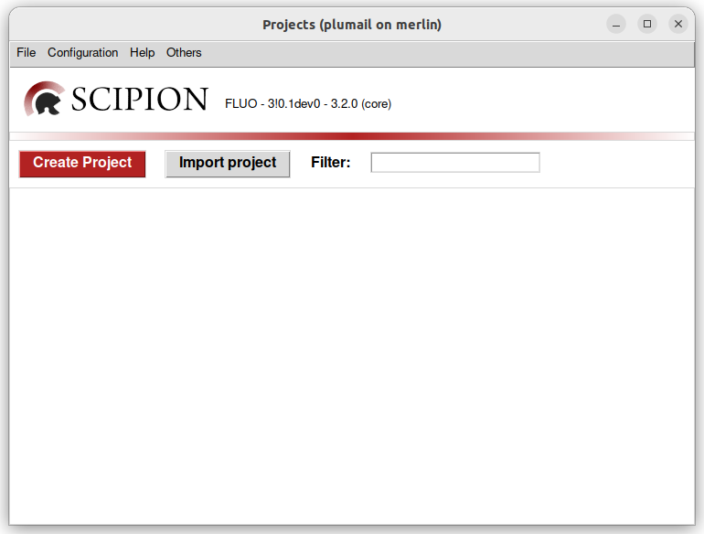

Installation
============

The **spfluo-app** is available on :ref:`Windows <windows-section>` and :ref:`Linux <linux-section>`. A GPU is recommended but not necessary.

.. _windows-section:

Windows
-------

On Windows, the installation is as simple as downloading an executable:

a. If you have an NVIDIA GPU, download `spfluo-app-gpu.exe <https://github.com/jplumail/spfluo-app/releases/download/v0.2.1/spfluo-app-gpu.exe>`_.
b. If not, download `spfluo-app.exe <https://github.com/jplumail/spfluo-app/releases/download/v0.2.1/spfluo-app.exe>`_. 

The executable will install the requirements and launch the app.

.. _linux-section:

Linux
-----

1. Install Python
    Python should already be availble on your distribution. If you have Ubuntu for instance, the command ``python3`` should be available.

2. Create a virtual environnement in the directory ``/path/to/spfluo-app-venv``::

    $ python3 -m venv spfluo-app-venv
    $ source /path/to/spfluo-app-venv/bin/activate

3. Install **spfluo-app** in the virtual environnement using the following command.
    - If you have a GPU::

        $ python3 -m pip install -r https://github.com/jplumail/spfluo-app/releases/download/v0.2.1/requirements-cp311-x86_64-unknown-linux-gnu-gpu.txt
    - Otherwise::

        $ python3 -m pip install -r https://github.com/jplumail/spfluo-app/releases/download/v0.2.1/requirements-cp311-x86_64-unknown-linux-gnu.txt

4. The app will be available at ``/path/to/spfluo-app-venv/bin/spfluo-app``.

You should now see the Scipion launcher :numref:`[%s] <scipion-launcher>`.

.. _scipion-launcher:

   The Scipion launcher

Go to :doc:`tutorial/index` to get started with using **spfluo-app**.

Upgrade
-------

To upgrade your installation to the latest version, go to the **spfluo-app**'s `github release page <https://github.com/jplumail/spfluo-app/releases>`_.
Find the link of the requirements corresponding to the latest version of your system.

For example, on a Windows machine with a GPU, copy the link : ``requirements-cp311-x86_64-pc-windows-msvc-gpu.txt``.

Windows
-------

In a terminal, run::

    $ spfluo-app.exe self pip install -r REQUIREMENTS_LINK

Linux
-----

To upgrade your installation::

    $ source /path/to/spfluo-app-venv/bin/activate
    $ python3 -m pip install -r REQUIREMENTS_LINK